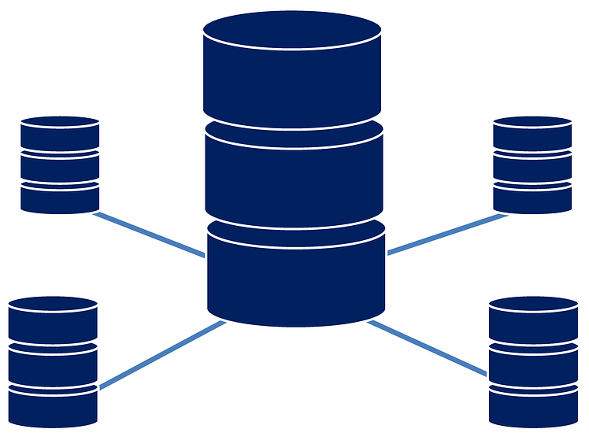

# SQL Nanodegree: Udiddit, a social news aggregator




The goal of the project was to create a normalized, consistent and performant relational database.


## Table of Contents
1. [Introduction](#introduction)
2. [Folder Structure](#folder_structure)
3. [Data Provided](#data_provided)
4. [Project Results](#project_results)    
5. [Authors](#authors)
6. [Project Motivation](#motivation)
7. [Acknowledgements](#acknowledgement)


<a name="introduction"></a>

## Introduction

My task was to use SQL Database Definition Language (DDL) to create a data schema designed in Postgres and SQL Database Manipulation Language (DML) to migrate data from a denormalized schema to a normalized one.


<a name="folder_structure"></a>

## Folder Structure

```
C:.
│   Udiddit-a-social-news-aggregator_Michael Fuchs.pdf
│   Udiddit.sql
│
└───images
        database.png
```


<a name="data_provided"></a>

## Data Provided

A PostgreSQL database provided by Udacity contained the following two tables:

+ bad_posts
+ bad_comments


<a name="project_results"></a>

## Project Results

The task given to me was divided into three parts:

+ Part I: Investigate the existing schema
+ Part II: Create the DDL for your new schema
+ Part III: Migrate the provided data


The first step was to identify errors and inefficiencies in the existing database. Then it was my task to design a new database structure according to the following criteria and to migrate the existing data accordingly.

```
Here is a list of features and specifications that Udiddit 
needs in order to support its website and administrative interface:

        a. Allow new users to register:
                i. Each username has to be unique
                ii. Usernames can be composed of at most 25 characters
                iii. Usernames can’t be empty
                iv. We won’t worry about user passwords for this project
        b. Allow registered users to create new topics:
                i. Topic names have to be unique.
                ii. The topic’s name is at most 30 characters
                iii. The topic’s name can’t be empty
                iv. Topics can have an optional description of at most 500 characters.
        c. Allow registered users to create new posts on existing topics:
                i. Posts have a required title of at most 100 characters
                ii. The title of a post can’t be empty.
                iii. Posts should contain either a URL or a text content, but not both.
                iv. If a topic gets deleted, all the posts associated with it should be automatically deleted too.
                v. If the user who created the post gets deleted, then the post will remain, but it will become dissociated from that user.
        d. Allow registered users to comment on existing posts:
                i. A comment’s text content can’t be empty.
                ii. Contrary to the current linear comments, the new structure should allow comment threads at arbitrary levels.
                iii. If a post gets deleted, all comments associated with it should be automatically deleted too.
                iv. If the user who created the comment gets deleted, then the comment will remain, but it will become dissociated from that user.
                v. If a comment gets deleted, then all its descendants in the thread structure should be automatically deleted too.
        e. Make sure that a given user can only vote once on a given post:
                i. Hint: you can store the (up/down) value of the vote as the values 1 and -1 respectively.
                ii. If the user who cast a vote gets deleted, then all their votes will remain, but will become dissociated from the user.
                iii. If a post gets deleted, then all the votes for that post should be automatically deleted too.
```


<a name="authors"></a>

## Authors

+ [Michael Fuchs](https://github.com/MFuchs1989)

Here is still the link to [my SQL blog posts](https://michael-fuchs-sql.netlify.app/).


<a name="motivation"></a>

## Project Motivation: 

As an [enthusiastic Data Scientist](https://michael-fuchs-python.netlify.app/), the collection and preparation of data is central, in addition to the creation of Machine / Deep Learning models. 
This project and its leading courses showed me how to use SQL queries to define, [select](https://michael-fuchs-sql.netlify.app/2021/03/23/data-wrangling/), [manipulate](https://michael-fuchs-sql.netlify.app/2021/03/29/data-manipulation/), control access to, [aggregate](https://michael-fuchs-sql.netlify.app/2021/03/26/data-aggregation/) and join data and data tables. 
Furthermore, the treatment of [subqueries](https://michael-fuchs-sql.netlify.app/2021/04/01/subqueries/), various window functions as well as partitions to complete complex tasks was central. 

<a name="acknowledgement"></a>

## Acknowledgements

I thank [Udacity](https://www.udacity.com/) for providing this challenge and learning experience. 
